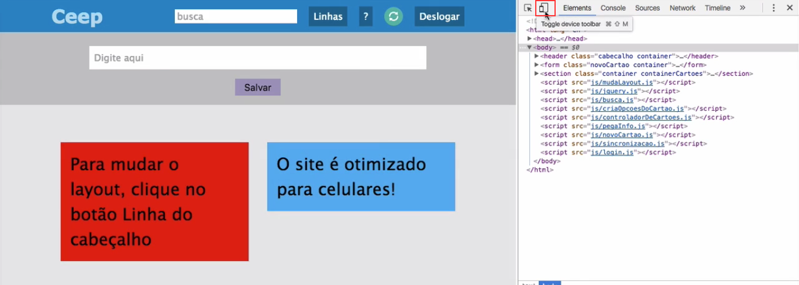

# Chrome DevTools: analise, inspecione e depure suas páginas Web

 

### Habilidades exercitadas neste curso:
- Domine as ferramentas de desenvolvimento do Chrome
- Aumente sua produtividade no desenvolvimento Web
- Aprenda a usar o Inspetor de Elementos além do básico
- Analise a performance com as abas Network e Timeline
- Descubra erros no seu JS com o debugger
- Manipule os dados e cookies do seu site
