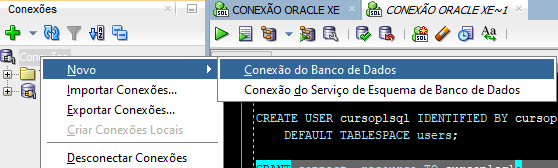
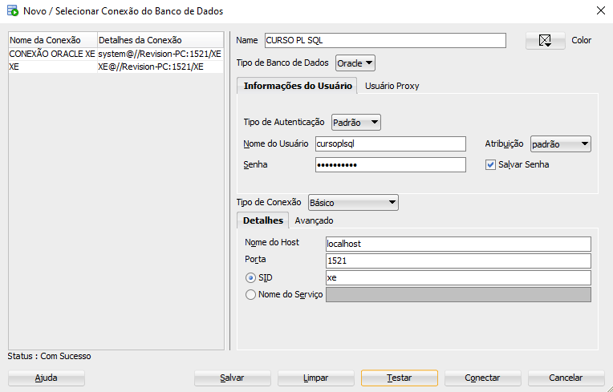

# Oracle PL/SQL: Procedures, funções e exceções
Repositório de exercícios propostos pelo **[Curso 4](https://cursos.alura.com.br/course/oracle-plsql-procedures-funcoes-excecoes)** da Formação "SQL com Oracle Database" da **[Alura](https://www.alura.com.br/)**.


Software utilizado: **[SQL Developer](https://www.oracle.com/tools/downloads/sqldev-downloads.html)**.

<br>

- Os principais comandos PL/SQL
- Inserir, atualizar e remover dados de tabelas
- Criar procedures e funções para encapsular código
- Recuperar registros com o Cursor
- Tratar e definir exceções

<br>

## Resumo

#### Criando um novo usuário e concedendo privilégios de acesso ao usuário no ambiente:

```sql
ALTER SESSION SET "_oracle_script" = true;

CREATE USER cursoplsql IDENTIFIED BY cursoplsql
    DEFAULT TABLESPACE users;

GRANT connect, resource TO cursoplsql;
```

<br>

#### Criando uma conexão e conectando o usuário nela




<br>

#### Criando o esquema:

```sql
CREATE TABLE segmercado (
    id         NUMBER(5),
    descricao  VARCHAR2(100)
);

CREATE TABLE cliente (
    id                    NUMBER(5),
    razao_social          VARCHAR2(100),
    cnpj                  VARCHAR2(20),
    segmercado_id         NUMBER(5),
    data_inclusao         DATE,
    faturamento_previsto  NUMBER(10, 2),
    categoria             VARCHAR2(20)
);

ALTER TABLE segmercado ADD CONSTRAINT segmercado_id_pk PRIMARY KEY ( id );

ALTER TABLE cliente ADD CONSTRAINT cliente_id_pk PRIMARY KEY ( id );

ALTER TABLE cliente
  ADD CONSTRAINT cliente_segmercado_fk FOREIGN KEY ( segmercado_id )
    REFERENCES segmercado ( id );
```

<br>

#### Exemplo de um bloco PL/SQL:

```sql
SET SERVEROUTPUT ON;

DECLARE
    v_id NUMBER(5) := 1;
BEGIN
    v_ID := 2;
    dbms_output.put_line(v_id);
END;
```

<br>

#### Concedendo mais privilégios de acesso ao usuário "cursoplsql" / quota ilimitada para armazenar dados no tablespace:

```sql
ALTER USER cursoplsql
    QUOTA UNLIMITED ON users;
```
*Obs.: Utilizar o comando acima como script da conexão padrão (na conexão de instalação).*
<br>

#### Execução de comandos SQL em blocos PL/SQL:

SQL
```sql
INSERT INTO segmercado (
    id,
    descricao
) VALUES (
    1,
    'Varejo'
);
```

<br>

PL/SQL
```sql
DECLARE
    v_id         NUMBER(5) := 1;
    v_descricao  VARCHAR2(100) := 'Varejo';
BEGIN
    INSERT INTO segmercado (
        id,
        descricao
    ) VALUES (
        v_id,
        v_descricao
    );

    COMMIT;
END
```

<br>

#### Usando upper (para evitar erros de case sensitive no select) e usando Percent Type (caso houver mudança na estrutura do banco de dados, o programa não apresentará problemas)
```sql
DECLARE
    v_id         NUMBER(5) := 1;
    v_descricao  VARCHAR2(100) := 'Varejo';
BEGIN
    INSERT INTO segmercado (
        id,
        descricao
    ) VALUES (
        v_id,
        upper(v_descricao)
    );

    COMMIT;
END;
```

<br>

#### Usando vários comandos em bloco:
```sql
DECLARE
    v_ID         segmercado.id%TYPE := 2;
    v_DESCRICAO  segmercado.descricao%TYPE := 'Atacadista';
BEGIN
    UPDATE segmercado SET descricao = upper(v_DESCRICAO) WHERE id = v_ID;
    
    v_ID := 1;
    v_DESCRICAO := 'Varejista';
    UPDATE segmercado SET descricao = upper(v_DESCRICAO) WHERE id = v_ID;

    COMMIT;
END;
```

<br>

#### Removendo registros com PL/SQL:
```sql
DECLARE
    v_id segmercado.id%TYPE := 3;
BEGIN
    DELETE FROM segmercado WHERE id = v_id;

    COMMIT;
END;
```

<br>

#### Criando procedures
```sql
-- cria a procedure
CREATE PROCEDURE incluir_segmercado (
    p_id         IN  NUMBER,
    p_descricao  IN  VARCHAR2
) IS
BEGIN
    INSERT INTO segmercado (
        id,
        descricao
    ) VALUES (
        p_id,
        upper(p_descricao)
    );

    COMMIT;
END;

-- executa a procedura criada
EXECUTE incluir_segmercado(3, 'Farmaceuticos');

-- outra forma de executar a procedura criada
BEGIN
    incluir_segmercado(4, 'Industrial');
END;
```

<br>

#### Alterando procedures 
```sql
CREATE OR REPLACE PROCEDURE incluir_segmercado (
    p_id         IN  segmercado.id%TYPE,
    p_descricao  IN  segmercado.descricao%TYPE
) IS
BEGIN
    INSERT INTO segmercado (
        id,
        descricao
    ) VALUES (
        p_id,
        upper(p_descricao)
    );

    COMMIT;
END;
```

<br>

#### Retornando o descritor do segmento
```sql
SET SERVEROUTPUT ON;

DECLARE
    v_id         segmercado.id%TYPE := 1;
    v_descricao  segmercado.descricao%TYPE;
BEGIN
    SELECT
        descricao
    INTO v_descricao
    FROM
        segmercado
    WHERE
        id = v_id;

    dbms_output.put_line(v_descricao);
END;
```

<br>

#### Criando uma função
```sql
CREATE OR REPLACE FUNCTION obter_descricao_segmercado (
    p_id IN segmercado.id%TYPE
) RETURN segmercado.descricao%TYPE 
IS
    v_descricao segmercado.descricao%TYPE;
BEGIN
    SELECT
        descricao
    INTO v_descricao
    FROM
        segmercado
    WHERE
        id = p_id;

    RETURN v_descricao;
END;
```

<br>

#### Executando uma função
```sql
-- Utilizando SQL Puro
VARIABLE g_descricao VARCHAR2(100);

EXECUTE :g_descricao := obter_descricao_segmercado(1);

PRINT g_descricao;
/*
OUTPUT:
Procedimento PL/SQL concluído com sucesso.


G_DESCRICAO
--------------------------------------------------------------------------------
VAREJISTA
*/

-- Utilizando PL/SQL
SET SERVEROUTPUT ON;

DECLARE
    v_descricao segmercado.descricao%TYPE;
BEGIN
    v_descricao := obter_descricao_segmercado(2);
    dbms_output.put_line('A descrição do Segmento de Mercado é ' || v_descricao);
END;
/*
OUTPUT:
A descrição do Segmento de Mercado é ATACADISTA


Procedimento PL/SQL concluído com sucesso.
*/
```

<br>

#### Manipulando tabela "clientes":
```sql
CREATE OR REPLACE PROCEDURE incluir_cliente (
    p_id                    IN  cliente.id%TYPE,
    p_razao_social          IN  cliente.razao_social%TYPE,
    p_cnpj                  IN  cliente.cnpj%TYPE,
    p_segmercado_id         IN  cliente.segmercado_id%TYPE,
    p_faturamento_previsto  IN  cliente.faturamento_previsto%TYPE
) IS
BEGIN
    INSERT INTO cliente (
        id,
        razao_social,
        cnpj,
        segmercado_id,
        data_inclusao,
        faturamento_previsto,
        categoria
    ) VALUES (
        p_id,
        p_razao_social,
        p_cnpj,
        p_segmercado_id,
        sysdate,
        p_faturamento_previsto,
        '00000'
    );

    COMMIT;
END;

EXECUTE incluir_cliente(2, 'supermercado ijk', '67890', 1, 90000);
```

<br>

#### Obtendo a categoria com IF ELSIF ELSE
```sql
SET SERVEROUTPUT ON;

DECLARE
    v_faturamento_previsto  cliente.faturamento_previsto%TYPE := 65000;
    v_categoria             cliente.categoria%TYPE;
BEGIN
    IF v_faturamento_previsto < 10000 THEN
        v_categoria := 'PEQUENO';
    ELSIF v_faturamento_previsto < 50000 THEN
        v_categoria := 'MÉDIO';
    ELSIF v_faturamento_previsto < 100000 THEN
        v_categoria := 'MÉDIO GRANDE';
    ELSE
        v_categoria := 'GRANDE';
    END IF;

    dbms_output.put_line('A Categoria é ' || v_categoria);
END;
```

<br>

#### Criando a função de obter categoria (conforme procedure acima)
```sql
CREATE OR REPLACE FUNCTION categoria_cliente (
    p_faturamento_previsto IN cliente.faturamento_previsto%TYPE
) RETURN cliente.categoria%TYPE IS
    v_categoria cliente.categoria%TYPE;
BEGIN
    IF p_faturamento_previsto < 10000 THEN
        v_categoria := 'PEQUENO';
    ELSIF p_faturamento_previsto < 50000 THEN
        v_categoria := 'MÉDIO';
    ELSIF p_faturamento_previsto < 100000 THEN
        v_categoria := 'MÉDIO GRANDE';
    ELSE
        v_categoria := 'GRANDE';
    END IF;

    RETURN v_categoria;
END;
```

<br>

### Editando a função incluir_cliente recebendo a categoria correta:
```sql
CREATE OR REPLACE PROCEDURE incluir_cliente (
    p_id                    IN  cliente.id%TYPE,
    p_razao_social          IN  cliente.razao_social%TYPE,
    p_cnpj                  IN  cliente.cnpj%TYPE,
    p_segmercado_id         IN  cliente.segmercado_id%TYPE,
    p_faturamento_previsto  IN  cliente.faturamento_previsto%TYPE
) IS
    v_categoria cliente.categoria%TYPE;
BEGIN
    v_categoria := categoria_cliente(p_faturamento_previsto);
    INSERT INTO cliente (
        id,
        razao_social,
        cnpj,
        segmercado_id,
        data_inclusao,
        faturamento_previsto,
        categoria
    ) VALUES (
        p_id,
        p_razao_social,
        p_cnpj,
        p_segmercado_id,
        sysdate,
        p_faturamento_previsto,
        v_categoria
    );

    COMMIT;
END;
```

<br>

### Criando uma procedure para formatar a saída do campo CNPJ:
```sql
CREATE OR REPLACE PROCEDURE formata_cnpj (
    p_cnpj IN OUT cliente.cnpj%TYPE
) IS
BEGIN
    p_cnpj := substr(p_cnpj, 1, 3)
              || '/'
              || substr(p_cnpj, 4, 2);
END;


```

<br>

### Usando a procedure `formata_cnpj` dentro de `incluir_cliente` para incluir o cnpj formatado:
```sql
CREATE OR REPLACE PROCEDURE incluir_cliente (
    p_id                    IN  cliente.id%TYPE,
    p_razao_social          IN  cliente.razao_social%TYPE,
    p_cnpj                  IN  cliente.cnpj%TYPE,
    p_segmercado_id         IN  cliente.segmercado_id%TYPE,
    p_faturamento_previsto  IN  cliente.faturamento_previsto%TYPE
) IS
    v_categoria  cliente.categoria%TYPE;
    v_cnpj       cliente.cnpj%TYPE := p_cnpj;
BEGIN
    formata_cnpj(v_cnpj);
    v_categoria := categoria_cliente(p_faturamento_previsto);
    INSERT INTO cliente (
        id,
        razao_social,
        cnpj,
        segmercado_id,
        data_inclusao,
        faturamento_previsto,
        categoria
    ) VALUES (
        p_id,
        p_razao_social,
        v_cnpj,
        p_segmercado_id,
        sysdate,
        p_faturamento_previsto,
        v_categoria
    );

    COMMIT;
END;
```

<br>

### Procedure para atualizar o segmento de mercado de um cliente:
```sql
CREATE OR REPLACE PROCEDURE atualizar_cli_seg_mercado (
    p_id             cliente.id%TYPE,
    p_segmercado_id  cliente.segmercado_id%TYPE
) IS
BEGIN
    UPDATE cliente
    SET
        segmercado_id = p_segmercado_id
    WHERE
        id = p_id;

    COMMIT;
END;
```

<br>

### Criando um Loop para atualizar o segmento de mercado dos clientes:
```sql
DECLARE
    v_segmercado_id cliente.segmercado_id%TYPE := 3;
BEGIN
    FOR v_id IN 1..6 LOOP
        atualizar_cli_seg_mercado(p_id => v_id, p_segmercado_id => v_segmercado_id);
    END LOOP;
END;
```

<br>

### Criando um CURSOR:
```sql
SET SERVEROUTPUT ON;

DECLARE
    CURSOR cur_cliente IS
    SELECT
        id,
        razao_social
    FROM
        cliente;

    v_id            cliente.id%TYPE;
    v_razao_social  cliente.razao_social%TYPE;
BEGIN
    OPEN cur_cliente;
    LOOP
        FETCH cur_cliente INTO
            v_id,
            v_razao_social;
        EXIT WHEN cur_cliente%notfound;
        dbms_output.put_line('ID = ' || v_id);
        dbms_output.put_line(v_razao_social);
    END LOOP;

    CLOSE cur_cliente;
END;
```

<br>

### Simplificando um cursor com FOR:
```sql
DECLARE
    CURSOR cur_cliente IS
    SELECT
        id
    FROM
        cliente;

    v_segmercado_id cliente.segmercado_id%TYPE := 1;
BEGIN
    FOR cli_rec IN cur_cliente LOOP
        atualizar_cli_seg_mercado(p_segmercado_id => v_segmercado_id, p_id => cli_rec.id);
    END LOOP;
END;
```

<br>

### Introduzindo exceções:
```sql
CREATE OR REPLACE PROCEDURE incluir_cliente (
    p_id                    IN  cliente.id%TYPE,
    p_razao_social          IN  cliente.razao_social%TYPE,
    p_cnpj                  IN  cliente.cnpj%TYPE,
    p_segmercado_id         IN  cliente.segmercado_id%TYPE,
    p_faturamento_previsto  IN  cliente.faturamento_previsto%TYPE
) IS
    v_categoria  cliente.categoria%TYPE;
    v_cnpj       cliente.cnpj%TYPE := p_cnpj;
BEGIN
    formata_cnpj(v_cnpj);
    v_categoria := categoria_cliente(p_faturamento_previsto);
    INSERT INTO cliente (
        id,
        razao_social,
        cnpj,
        segmercado_id,
        data_inclusao,
        faturamento_previsto,
        categoria
    ) VALUES (
        p_id,
        p_razao_social,
        v_cnpj,
        p_segmercado_id,
        sysdate,
        p_faturamento_previsto,
        v_categoria
    );

    COMMIT;
EXCEPTION
    WHEN dup_val_on_index THEN
        dbms_output.put_line('CLIENTE JÁ CADASTRADO!');
END;
```

<br>

### Lançando exceção não prevista. E agora com "raise_application_error" (ao invés de "dbms_output.put_line"):
```sql
CREATE OR REPLACE PROCEDURE incluir_cliente (
    p_id                    IN  cliente.id%TYPE,
    p_razao_social          IN  cliente.razao_social%TYPE,
    p_cnpj                  IN  cliente.cnpj%TYPE,
    p_segmercado_id         IN  cliente.segmercado_id%TYPE,
    p_faturamento_previsto  IN  cliente.faturamento_previsto%TYPE
) IS

    v_categoria  cliente.categoria%TYPE;
    v_cnpj       cliente.cnpj%TYPE := p_cnpj;
    e_null EXCEPTION;
    PRAGMA exception_init ( e_null, -1400 );
BEGIN
    formata_cnpj(v_cnpj);
    v_categoria := categoria_cliente(p_faturamento_previsto);
    INSERT INTO cliente (
        id,
        razao_social,
        cnpj,
        segmercado_id,
        data_inclusao,
        faturamento_previsto,
        categoria
    ) VALUES (
        p_id,
        p_razao_social,
        v_cnpj,
        p_segmercado_id,
        sysdate,
        p_faturamento_previsto,
        v_categoria
    );

    COMMIT;
EXCEPTION
    WHEN dup_val_on_index THEN
        raise_application_error(-20010, 'Cliente já cadastrado !!!!');
    WHEN e_null THEN
        raise_application_error(-20015, 'A coluna ID não pode receber valores nulos ou vazios !!!!');
END;
```

<br>

### Lançando exceções não cadastradas (erro genérico):
```sql
CREATE OR REPLACE PROCEDURE incluir_cliente (
    p_id                    IN  cliente.id%TYPE,
    p_razao_social          IN  cliente.razao_social%TYPE,
    p_cnpj                  IN  cliente.cnpj%TYPE,
    p_segmercado_id         IN  cliente.segmercado_id%TYPE,
    p_faturamento_previsto  IN  cliente.faturamento_previsto%TYPE
) IS

    v_categoria  cliente.categoria%TYPE;
    v_cnpj       cliente.cnpj%TYPE := p_cnpj;
    e_null EXCEPTION;
    PRAGMA exception_init ( e_null, -1400 );
BEGIN
    formata_cnpj(v_cnpj);
    v_categoria := categoria_cliente(p_faturamento_previsto);
    INSERT INTO cliente (
        id,
        razao_social,
        cnpj,
        segmercado_id,
        data_inclusao,
        faturamento_previsto,
        categoria
    ) VALUES (
        p_id,
        p_razao_social,
        v_cnpj,
        p_segmercado_id,
        sysdate,
        p_faturamento_previsto,
        v_categoria
    );

    COMMIT;
EXCEPTION
    WHEN dup_val_on_index THEN
        raise_application_error(-20010, 'Cliente já cadastrado !!!!');
    WHEN e_null THEN
        raise_application_error(-20015, 'A coluna ID não pode receber valores nulos ou vazios !!!!');
    WHEN OTHERS THEN
        raise_application_error(-20020, 'Erro genérico : ' || sqlerrm());
END;
```

<br>

### Erros de usuário (exemplo: update em uma linha inexistente):
```sql
CREATE OR REPLACE PROCEDURE atualizar_cli_seg_mercado (
    p_id             cliente.id%TYPE,
    p_segmercado_id  cliente.segmercado_id%TYPE
) IS
    e_cliente_id_inexistente EXCEPTION;
BEGIN
    UPDATE cliente
    SET
        segmercado_id = p_segmercado_id
    WHERE
        id = p_id;

    IF SQL%notfound THEN
        RAISE e_cliente_id_inexistente;
    END IF;
    COMMIT;
EXCEPTION
    WHEN e_cliente_id_inexistente THEN
        raise_application_error(-20100, 'Cliente inexistente !!!!');
END;
```
