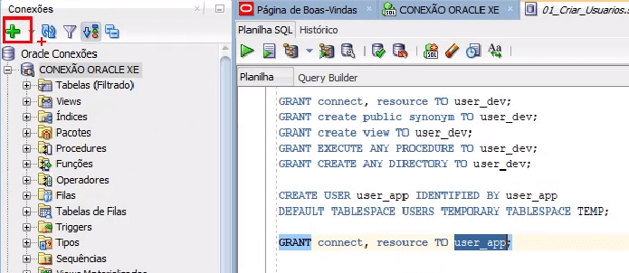
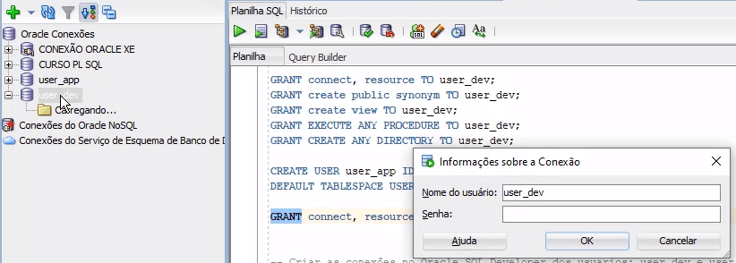
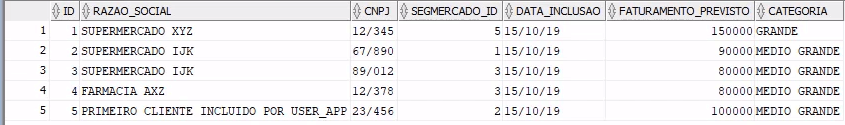
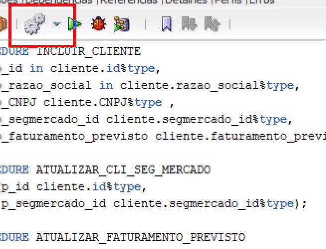

# Oracle PL/SQL: Dominando packages
Repositório de exercícios propostos pelo **[Curso 5](https://cursos.alura.com.br/course/oracle-plsql-dominando-packages)** da Formação "SQL com Oracle Database" da **[Alura](https://www.alura.com.br/)**.


Software utilizado: **[SQL Developer](https://www.oracle.com/tools/downloads/sqldev-downloads.html)**.

<br>

- Aplicando sinônimos e privilégios nos pacotes
- Gerenciando as dependências
- Entendendo e usando a sobrecarga corretamente
- Encapsulando código com rotinas internas
- Trabalhando com exceções e constantes


<br>

### Começando:

01) No menu superior, clique em Arquivo e depois em Abrir. Abra o script 01_Criar_Usuarios.sql.

02) Acima de todos os comandos do script, digite o seguinte comando para criar uma variável de sessão, para executar comandos em sequência. Logo em seguida, execute-o:

```sql
ALTER SESSION SET "_ORACLE_SCRIPT"=true;
```

03) Selecione todo o código restante e depois execute-o.

04) Crie agora uma nova conexão no SQL developer. Para isso, clique no sinal de adição +, na aba Conexões, no lado esquerdo da tela.



05) Nos campos Name, Nome do Usuário e Senha, digite user_dev. Em seguida, clique em Salvar.

06) Clique novamente no + para criar uma nova conexão.

07) Nos campos Name, Nome do Usuário e Senha, digite user_app. Em seguida, clique em Salvar.

08) Agora, na aba Conexões, clique na conexão user_dev:



9) Preencha a senha e clique em OK.

10) No menu superior, vá novamente em Arquivo, depois em Abrir e selecione o arquivo 02_Criar_Tabelas.sql.

11) Selecione o código completo do script e execute-o.

12) Volte à conexão CONEXÃO ORACLE XE, digite e execute os códigos abaixo:

```sql
ALTER USER user_dev QUOTA UNLIMITED ON USERS;

ALTER USER user_app QUOTA UNLIMITED ON USERS;
```

13) De volta à conexão user_dev, abra o arquivo 03_Incluir_Dados_Tabelas.sql.

14) Selecione todo o script e execute-o.

15) Agora, abra o arquivo 04_Criar_Ambiente_Curso.sql.

16) Selecione todo o script e execute o código.

17) Agora, crie um script associado à conexão user_dev.

18) Digite e execute os seguintes comandos, para dar os privilégios de acesso para o user_app:

```sql
GRANT EXECUTE ON atualizar_cli_seg_mercado TO user_app;

GRANT EXECUTE ON atualizar_faturamento_previsto TO user_app;

GRANT EXECUTE ON excluir_cliente TO user_app;

GRANT EXECUTE ON incluir_cliente TO user_app;
```

19) Para testar se o acesso está funcionando, crie um script associado à conexão user_app.

20) Digite e execute a seguinte procedure, para incluir um novo cliente:

```sql
EXECUTE user_dev.incluir_cliente(5, 'Primeiro Cliente incluido por user_app', '23456', 2, 100000);
```

21) Para visualizar a tabela, digite e execute o seguinte:

```sql
SELECT * FROM user_dev.CLIENTE;
```

22) A tabela é apresentada abaixo:



23) Note que o cliente 5 foi incluído com sucesso pelo usuário user_app.

<br>


### Exercícios

#### Criando sinônimos públicos para compartilhar objetos mais facilmente:

```sql
CREATE PUBLIC SYNONYM incluir_cliente FOR user_dev.incluir_cliente;

CREATE PUBLIC SYNONYM atualizar_cli_seg_mercado FOR user_dev.atualizar_cli_seg_mercado;

CREATE PUBLIC SYNONYM atualizar_faturamento_previsto FOR user_dev.atualizar_faturamento_previsto;

CREATE PUBLIC SYNONYM excluir_cliente FOR user_dev.excluir_cliente;

CREATE PUBLIC SYNONYM cliente FOR user_dev.cliente;
```

<br>

#### Criando pacotes (user_dev)

### Cabeçalho:

```sql
CREATE OR REPLACE PACKAGE cliente_pac IS
    PROCEDURE incluir_cliente (
        p_id                    IN  cliente.id%TYPE,
        p_razao_social          IN  cliente.razao_social%TYPE,
        p_cnpj                  cliente.cnpj%TYPE,
        p_segmercado_id         cliente.segmercado_id%TYPE,
        p_faturamento_previsto  cliente.faturamento_previsto%TYPE
    );
END;
```

### Corpo:

```sql
CREATE OR REPLACE PACKAGE BODY cliente_pac IS
    PROCEDURE incluir_cliente (
        p_id                    IN  cliente.id%TYPE,
        p_razao_social          IN  cliente.razao_social%TYPE,
        p_cnpj                  cliente.cnpj%TYPE,
        p_segmercado_id         cliente.segmercado_id%TYPE,
        p_faturamento_previsto  cliente.faturamento_previsto%TYPE
    ) IS

        v_categoria          cliente.categoria%TYPE;
        v_cnpj               cliente.cnpj%TYPE := p_cnpj;
        v_codigo_erro        NUMBER(5);
        v_mensagem_erro      VARCHAR2(200);
        v_dummy              NUMBER;
        v_verifica_segmento  BOOLEAN;
        e_segmento EXCEPTION;
    BEGIN
        v_verifica_segmento := verifica_segmento_mercado(p_segmercado_id);
        IF v_verifica_segmento = false THEN
            RAISE e_segmento;
        END IF;
        v_categoria := obter_categoria_cliente(p_faturamento_previsto);
        format_cnpj(v_cnpj);
        INSERT INTO cliente VALUES (
            p_id,
            upper(p_razao_social),
            v_cnpj,
            p_segmercado_id,
            sysdate,
            p_faturamento_previsto,
            v_categoria
        );
        COMMIT;
    EXCEPTION
        WHEN dup_val_on_index THEN
            raise_application_error(-20010, 'Cliente já cadastrado');
        WHEN e_segmento THEN
            raise_application_error(-20011, 'Segmento de mercado inexistente');
        WHEN OTHERS THEN
            v_codigo_erro := sqlcode;
            v_mensagem_erro := sqlerrm;
            raise_application_error(-20000, to_char(v_codigo_erro)
                                            || v_mensagem_erro);
    END;
END;
```

<br>

#### Concedendo permissão para outros usuários (conexão user_dev):
```sql
GRANT EXECUTE ON CLIENTE_PAC TO user_app;
```

<br>

#### Utilizando o pacote (conexão user_app):
```sql
EXECUTE user_dev.cliente_pac.incluir_cliente(10, 'PRIMEIRO CLIENTE INCLUIDO POR user_app VIA PACKAGE', '45678', 2, 120000);
```

<br>

#### Criando sinônimo do pacote (conexão user_dev):
```sql
CREATE PUBLIC SYNONYM cliente_pac FOR user_dev.cliente_pac;
```

<br>

#### Utilizando o pacote com sinônimo (conexão user_app):
```sql
EXECUTE cliente_pac.incluir_cliente(11, 'SEGUNDO CLIENTE INCLUIDO POR user_app VIA PACKAGE COM SINÔNIMO', '45678', 2, 120000);
```

<br>

#### Adicionando outras procedures no mesmo pacote - CABEÇALHO (conexão user_dev):
```sql
CREATE OR REPLACE PACKAGE cliente_pac IS
    PROCEDURE incluir_cliente (
        p_id                    IN  cliente.id%TYPE,
        p_razao_social          IN  cliente.razao_social%TYPE,
        p_cnpj                  cliente.cnpj%TYPE,
        p_segmercado_id         cliente.segmercado_id%TYPE,
        p_faturamento_previsto  cliente.faturamento_previsto%TYPE
    );

    PROCEDURE atualizar_cli_seg_mercado (
        p_id             cliente.id%TYPE,
        p_segmercado_id  cliente.segmercado_id%TYPE
    );

    PROCEDURE atualizar_faturamento_previsto (
        p_id                    IN  cliente.id%TYPE,
        p_faturamento_previsto  IN  cliente.faturamento_previsto%TYPE
    );

    PROCEDURE excluir_cliente (
        p_id IN cliente.id%TYPE
    );
END;
```

<br>

#### Adicionando outras procedures no mesmo pacote - CORPO (conexão user_dev):
```sql
create or replace PACKAGE BODY cliente_pac IS
  PROCEDURE incluir_cliente (
    p_id                    IN  cliente.id%TYPE,
    p_razao_social          IN  cliente.razao_social%TYPE,
    p_cnpj                  cliente.cnpj%TYPE,
    p_segmercado_id         cliente.segmercado_id%TYPE,
    p_faturamento_previsto  cliente.faturamento_previsto%TYPE
  ) IS
    v_categoria          cliente.categoria%TYPE;
    v_cnpj               cliente.cnpj%TYPE := p_cnpj;
    v_codigo_erro        NUMBER(5);
    v_mensagem_erro      VARCHAR2(200);
    v_dummy              NUMBER;
    v_verifica_segmento  BOOLEAN;
    e_segmento EXCEPTION;
  BEGIN
    v_verifica_segmento := verifica_segmento_mercado(p_segmercado_id);
    IF v_verifica_segmento = false THEN
      RAISE e_segmento;
    END IF;
    v_categoria := obter_categoria_cliente(p_faturamento_previsto);
    format_cnpj(v_cnpj);
    INSERT INTO cliente VALUES (
      p_id,
      upper(p_razao_social),
      v_cnpj,
      p_segmercado_id,
      sysdate,
      p_faturamento_previsto,
      v_categoria
    );

    COMMIT;
  EXCEPTION
    WHEN dup_val_on_index THEN
      raise_application_error(-20010, 'Cliente já cadastrado');
    WHEN e_segmento THEN
      raise_application_error(-20011, 'Segmento de mercado inexistente');
    WHEN OTHERS THEN
      v_codigo_erro := sqlcode;
      v_mensagem_erro := sqlerrm;
      raise_application_error(-20000, to_char(v_codigo_erro)
        || v_mensagem_erro);
  END;

  PROCEDURE atualizar_cli_seg_mercado (
    p_id             cliente.id%TYPE,
    p_segmercado_id  cliente.segmercado_id%TYPE
  ) IS
    e_fk EXCEPTION;
    PRAGMA exception_init ( e_fk, -2291 );
    e_no_update EXCEPTION;
  BEGIN
    UPDATE cliente
    SET segmercado_id = p_segmercado_id
    WHERE id = p_id;

    IF SQL%notfound THEN
      RAISE e_no_update;
    END IF;
    COMMIT;
  EXCEPTION
    WHEN e_fk THEN
      raise_application_error(-20001, 'Segmento de Mercado Inexistente');
    WHEN e_no_update THEN
      raise_application_error(-20002, 'Cliente Inexistente');
  END;

  PROCEDURE atualizar_faturamento_previsto (
    p_id                    IN  cliente.id%TYPE,
    p_faturamento_previsto  IN  cliente.faturamento_previsto%TYPE
  ) IS
    v_categoria cliente.categoria%TYPE;
    e_error_id EXCEPTION;
  BEGIN
    v_categoria := obter_categoria_cliente(p_faturamento_previsto);
    UPDATE cliente
      SET categoria = v_categoria,
        faturamento_previsto = p_faturamento_previsto
      WHERE id = p_id;

    IF SQL%notfound THEN
      RAISE e_error_id;
    END IF;
    COMMIT;
  EXCEPTION
    WHEN e_error_id THEN
      raise_application_error(-20010, 'Cliente inexistente');
  END;

  PROCEDURE excluir_cliente (
    p_id IN cliente.id%TYPE
  ) IS
    e_error_id EXCEPTION;
  BEGIN
    DELETE FROM cliente
    WHERE id = p_id;

    IF SQL%notfound THEN
      RAISE e_error_id;
    END IF;
    COMMIT;
  EXCEPTION
    WHEN e_error_id THEN
      raise_application_error(-20010, 'Cliente inexistente');
  END;
```

<br>

#### Criando sobrecarga:
- 1) Clique sobre o cabeçalho do pacote, através da árvore de objetos do SQL Developer. Haverá uma área de edição de texto com seu conteúdo, e sem a necessidade de copiar e colar em uma área de edição do SQL Developer. Insira a seguinte procedure no cabeçalho do pacote:

```sql
PROCEDURE incluir_cliente (
    p_id             IN  cliente.id%TYPE,
    p_razao_social   IN  cliente.razao_social%TYPE,
    p_segmercado_id  cliente.segmercado_id%TYPE
);
```
- 2) Clique no botão indicado abaixo e selecione a opção Compilar:



3) O próximo passo é complementar o corpo. Para isso, clique sobre CLIENTE_PAC Body para abrir a área de edição do corpo do pacote e acrescente ao código do corpo:

```sql
    PROCEDURE incluir_cliente (
        p_id             IN  cliente.id%TYPE,
        p_razao_social   IN  cliente.razao_social%TYPE,
        p_segmercado_id  cliente.segmercado_id%TYPE
    ) IS

        v_codigo_erro        NUMBER(5);
        v_mensagem_erro      VARCHAR2(200);
        v_dummy              NUMBER;
        v_verifica_segmento  BOOLEAN;
        e_segmento EXCEPTION;
    BEGIN
        v_verifica_segmento := verifica_segmento_mercado(p_segmercado_id);
        IF v_verifica_segmento = false THEN
            RAISE e_segmento;
        END IF;
        INSERT INTO cliente (
            id,
            razao_social,
            segmercado_id,
            data_inclusao
        ) VALUES (
            p_id,
            upper(p_razao_social),
            p_segmercado_id,
            sysdate
        );

        COMMIT;
    EXCEPTION
        WHEN dup_val_on_index THEN
            raise_application_error(-20010, 'Cliente já cadastrado');
        WHEN e_segmento THEN
            raise_application_error(-20011, 'Segmento de mercado inexistente');
        WHEN OTHERS THEN
            v_codigo_erro := sqlcode;
            v_mensagem_erro := sqlerrm;
            raise_application_error(-20000, to_char(v_codigo_erro)
                                            || v_mensagem_erro);
    END;
```

<br>

#### Internalizando rotinas 
```sql

```

<br>

...CONTINUA
<!-- 
#### 
```sql

```

<br>

#### Exemplo prático:

```sql
CREATE DATABASE banco_clientes;

USE banco_clientes;

CREATE TABLE tabela_clientes (
  idCliente int NOT NULL auto_increment,
  nomeEmpresa varchar(255) not null,
  nomeDiretor varchar(255) default NULL,
  numEmpregados mediumint default NULL,
  PRIMARY KEY (idCliente)
) ;

```

<br>

#### Exibir todas as tabelas do banco selecionado:

```sql
SHOW tables;
```

<br>

#### Obter informações sobre uma tabela:

```sql

```

<br>

#### 
```sql

```

<br>

#### 
```sql

```

<br>

#### 
```sql

```

<br>

#### 
```sql

```

<br>

#### 
```sql

```

<br>

#### 
```sql

```

<br> 

## EXERCÍCIOS

**Realizar as operações no MySQL conforme as tabelas apresentadas abaixo.**


<hr>
<br>

### [Exercício 1]
**Recuperar o nome e o endereço de todos os funcionários que trabalham para o departamento "Pesquisa".**


<hr>
<br>

### [EXERCÍCIO 2] 
**Para cada projeto localizado em "Mauá", liste o número do projeto, o número do departamento que o controla, o último nome, endereço e data de nascimento do gerente do departamento.**


<hr>
<br>

### [EXERCÍCIO 3] 
**Descobrir os nomes dos funcionários que trabalham em todos os projetos controlados pelo departamento 5.**


<hr>
<br>

### [EXERCÍCIO 4] 
**Fazer uma lista dos números de projetos para aqueles que envolvem um funcionário cujo último nome é 'Souza'. Seja como trabalhador, seja como gerente do departamento que controla o projeto.**


<hr>
<br>

### [EXERCÍCIO 5] 
**Recuperar os nomes dos funcionários que não possuem dependentes.**


<hr>
<br>

### [EXERCÍCIO 6] 
**Listar o nome dos gerentes que possuem pelo menos um dependente.**


<hr>
<br>

 -->