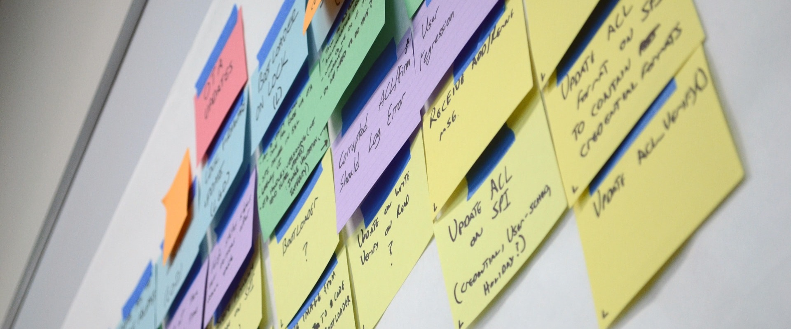

<h1 align="center">Kanban</h1>

  

## ÍNDICE
<!--
- [Review Meeting](#review-meeting)
- [Definição de Pronto](#definição-de-pronto)
- [Retrospectiva](#retrospectiva)
- [Ações](#ações)
- [Daily Scrum](#daily-scrum)
- [Planning Meeting](#planning-meeting)
- [Product e Sprint Backlogs](#product-e-sprint-backlogs)
  - [Product Backlog](#product-backlog)
  - [Sprint Backlog](#sprint-backlog)
  - [Histórias e tarefas](#histórias-e-tarefas)
- [Scrum Master](#scrum-master)
  - [O dia a dia de um Scrum Master](#o-dia-a-dia-de-um-scrum-master)
  - [Evolução do papel](#evolução-do-papel)
  - [Problemas e impedimentos](#problemas-e-impedimentos)
- [Product Owner](#product-owner)
  - [O dia a dia de um PO](#o-dia-a-dia-de-um-product-owner)
  - [Refinamento do backlog](#refinamento-do-backlog)
  - [Um pessoa só](#uma-pessoa-só)
- [Desenvolvedor](#desenvolvedor)
- [Papeis do time todo](#papeis-do-time-todo)
  - [Uma única restrição](#uma-única-restrição)
-->
- [Exercícios](#exercícios)

 

### História da Toyota 

Taiichi Ohno, um dos criadores do Sistema de Produção Toyota, “os dois pilares do Sistema de Produção Toyota são just-in-time e automação com um toque humano, ou autonomação. A ferramenta usada para operar o sistema é kanban”. Em outras palavras, kanban é fundamental para o processo de kaizen (“melhoria contínua”) usado na Toyota. É o mecanismo que faz com que ele funcione.

**A diferença entre os "kanban's"**

kanban - Palavra japonesa para cartão de sinal, Kanji, são as sílabas japonesas, são dois kanjis, o Kan ban.

Sistema kanban - refere-se ao sistema puxado implementado com cartões sinalizadores.

Método Kanban - David Anderson - é usado para se referir à metodologia de melhoria de processo incremental e evolutiva que surgiu na Corbis de 2006 a 2008 e continuou a evoluir na ampla comunidade de desenvolvimento Lean de software nos anos seguintes.

**Relação entre Lean, Kanban e Modelos Ágeis**

Kanban faz parte do pensamento Lean mas não é um Modelo Ágil.

**O que é um sistema puxado?**

Do inglês “pull system”, a produção puxada controla as operações fabris sem a utilização de estoque em processo. Neste modelo, diferentemente da produção empurrada, o fluxo de materiais ganha relevante importância. Dá-se com a utilização do Sistema Kanban.

**Diferenças do Kanban de outros modelos ágeis**

O principal limite é o WIP que indica quando o trabalho pode andar

É mais aberto quanto a adaptação, quanto mais o time aprende mais pode adaptar o quadro a sua realidade.

**Vantagens de usar o Kanban**
- Fluxo contínuo, melhor agilidade
- Mudança evolutiva, menor resistência
- Melhor previsibilidade, controle das variáveis, ritmo contínuo
- Melhor gerenciamento de risco

**Dicas de como começar a usar o Kanban**
- Comece de onde você está
- Concorde em melhorar incrementalmente
- Encoraje atos de liderança e inicialmente respeite papéis, responsabilidades e descrição de cargos.

[Video: Sistema Toyota de Produção - Lean I](https://www.youtube.com/watch?v=c6KVeDbgRgU)
[Video: Sistema Toyota de Produção - Lean II](https://www.youtube.com/watch?v=6vmdVR9dzPM)

 

### 

 

### 

 

### 

 

### 

 

### 

 

### 

 

### 

 

### 

 

### 

 

### 

 

### 

 

<h1 align="center">Exercícios</h1>

  

 

### Quais as principais vantagens do Kanban:

Mostrar resposta

 

> 
> Fluxo contínuo, melhor agilidade
> Mudança evolutiva, menor resistência
> Melhor previsibilidade
> Controle das variáveis
> Ritmo contínuo
> Melhor gerenciamento de risco
> 

 

### PERGUNTA

Mostrar resposta

 

> 
> RESPOSTA
> 

 

### PERGUNTA

Mostrar resposta

 

> 
> RESPOSTA
> 

 

### PERGUNTA

Mostrar resposta

 

> 
> RESPOSTA
> 

 

### PERGUNTA

Mostrar resposta

 

> 
> RESPOSTA
> 

 

### PERGUNTA

Mostrar resposta

 

> 
> RESPOSTA
> 

 

### PERGUNTA

Mostrar resposta

 

> 
> RESPOSTA
> 

 

### PERGUNTA

Mostrar resposta

 

> 
> RESPOSTA
> 

 

### PERGUNTA

Mostrar resposta

 

> 
> RESPOSTA
> 

 

### PERGUNTA

Mostrar resposta

 

> 
> RESPOSTA
> 

 

### PERGUNTA

Mostrar resposta

 

> 
> RESPOSTA
> 

 

### PERGUNTA

Mostrar resposta

 

> 
> RESPOSTA
> 

 

### PERGUNTA

Mostrar resposta

 

> 
> RESPOSTA
> 

 

### PERGUNTA

Mostrar resposta

 

> 
> RESPOSTA
> 

 

### PERGUNTA

Mostrar resposta

 

> 
> RESPOSTA
> 

 

### PERGUNTA

Mostrar resposta

 

> 
> RESPOSTA
> 

 

### PERGUNTA

Mostrar resposta

 

> 
> RESPOSTA
> 

 

### PERGUNTA

Mostrar resposta

 

> 
> RESPOSTA
> 

 

### PERGUNTA

Mostrar resposta

 

> 
> RESPOSTA
> 

 

### PERGUNTA

Mostrar resposta

 

> 
> RESPOSTA
> 

 

### PERGUNTA

Mostrar resposta

 

> 
> RESPOSTA
> 

 

### PERGUNTA

Mostrar resposta

 

> 
> RESPOSTA
> 

 

### PERGUNTA

Mostrar resposta

 

> 
> RESPOSTA
> 

 

### PERGUNTA

Mostrar resposta

 

> 
> RESPOSTA
> 

 

### PERGUNTA

Mostrar resposta

 

> 
> RESPOSTA
> 

 

### PERGUNTA

Mostrar resposta

 

> 
> RESPOSTA
> 

 

### PERGUNTA

Mostrar resposta

 

> 
> RESPOSTA
> 

 

### PERGUNTA

Mostrar resposta

 

> 
> RESPOSTA
> 

 

### PERGUNTA

Mostrar resposta

 

> 
> RESPOSTA
> 

 

### PERGUNTA

Mostrar resposta

 

> 
> RESPOSTA
> 

 

### PERGUNTA

Mostrar resposta

 

> 
> RESPOSTA
> 

 

### PERGUNTA

Mostrar resposta

 

> 
> RESPOSTA
> 

 

### PERGUNTA

Mostrar resposta

 

> 
> RESPOSTA
> 

 
