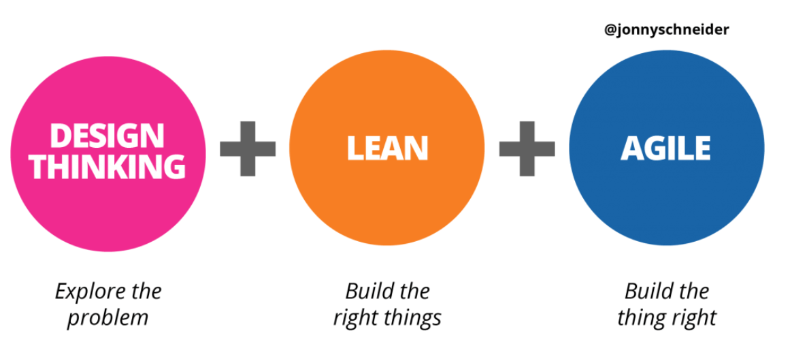

# Metodologias Lean e Ágeis

- [Fundamentos de Agilidade]()
  - Entenda porque surgiu o Método Ágil
  - Descubra as diferenças entre o Método Ágil e o Waterfall
  - Aprenda sobre a priorização de tarefas e fluxos
  - Saiba porque o feedback deve ser o mais rápido possível
  - Conheça o Manifesto Ágil
  - Entenda com trabalha uma equipe ágil
  - Descubra como se formam os diferentes tipos de equipe ágil
  - Aprenda a divisão de tarefas dentro da equipe
  - Saiba quais são as responsabilidades do Product Owner e do Scrum Master

- [Scrum]()
  - Aprenda o processo ágil mais popular do mercado.
  - Aplique esse processo em seu projeto
  - Veja como práticar uma Retrospectiva
  - Melhore o desempenho do seu time
  - Entregas mais rápidas e transparentes
  - Conheça a história do Scrum no contexto atual
  - Descubra o que são Métodos Ágeis de gerenciamento de projetos
  - Identifique as instituições certificadoras em Scrum
  - Compreenda o que é Scrum em uma visão geral
  - Some conhecimentos para preparar-se para as certificações profissionais em Scrum e ágil

- [Kanban]()
  - Aprenda a mapear, gerenciar e criticar fluxos de trabalho
  - Entenda como montar um quadro Kanban aplicando cartões
  - Aprenda a limitar o trabalho em progresso (WIP)
  - Como lidar com trabalhos urgentes x prioritárias no seu dia-a-dia
  - Quais são e como aplicar as Métricas do Kanban

 
