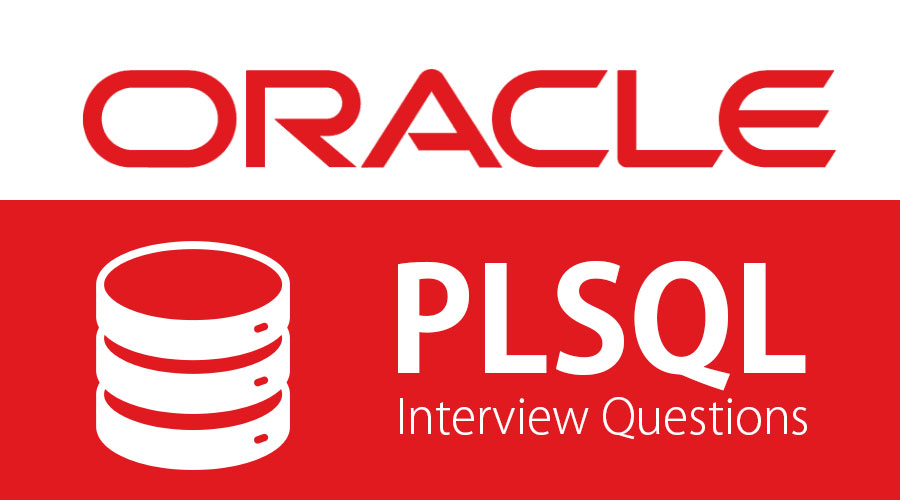

# SQL com Oracle Database

 

### [1. Introdução ao SQL com Oracle: Manipule e consulte dados](https://github.com/LeonarDev/Autoplay/tree/main/back-end/oracle_sql/curso1)

 

### [2. Consultas SQL no Oracle: Projeções, Seleções, Joins e Views](https://github.com/LeonarDev/Autoplay/tree/main/back-end/oracle_sql/curso2)

 

### [3. Manipulação de dados no Oracle: Comandos DML](https://github.com/LeonarDev/Autoplay/tree/main/back-end/oracle_sql/curso3)

 

### [4. Oracle PL/SQL: Procedures, funções e exceções](https://github.com/LeonarDev/Autoplay/tree/main/back-end/oracle_sql/curso4)

 

### [5. Oracle PL/SQL: Dominando packages](https://github.com/LeonarDev/Autoplay/tree/main/back-end/oracle_sql/curso5)

 