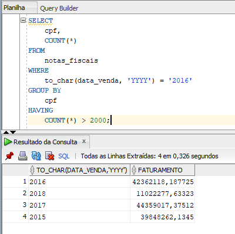

# Consultas SQL no Oracle: Projeções, Seleções, Joins e Views
Repositório de exercícios propostos pelo **[Curso 2](https://cursos.alura.com.br/course/oracle-database-consultas-sql)** da Formação "SQL com Oracle Database" da **[Alura](https://www.alura.com.br/)**.

Software utilizado: **[SQL Developer](https://www.oracle.com/tools/downloads/sqldev-downloads.html)**.

 

- Projeções e seleções
- Consultas com condicionais LIKE, DISTINCT e HAVING
- JOINs e seus tipos
- Sub-consultas para refinar os resultados
- Views no banco de dados
- Funções principais no Oracle

## EXERCÍCIOS

### [Exercício 1]
**Quantos clientes possuem o último sobrenome Mattos?**

 

### [EXERCÍCIO 2] 
**Quantos bairros diferentes da cidade do Rio de Janeiro possuem clientes?**

 

### [EXERCÍCIO 3] 
**Queremos obter as 10 primeiras vendas do dia 01/01/2017. Qual seria o comando SQL para obter este resultado?**

 

### [EXERCÍCIO 4] 
**Utilizando duas querys SQL, qual foi a maior venda do produto "Linha Refrescante - 1 Litro - Morango/Limao", em quantidade?**

 

### [EXERCÍCIO 5] 
**Aproveitando o exercício do vídeo anterior, quantos itens existem com a maior quantidade de venda para o produto '1101035'?**

 

### [EXERCÍCIO 6] 
**Veja o ano de nascimento dos clientes e classifique-os como:**

- **Nascidos antes de 1990 são velhos**
- **Nascidos entre 1990 e 1995 são jovens**
- **Nascidos depois de 1995 são crianças**

**Liste o nome dos clientes e suas classificações.**

 

### [EXERCÍCIO 7] 
**Como agrupar os produtos por embalagem, pegar a média de preço para cada tipo de embalagem e conferir o status de preço para cada embalagem (caro/em conta/barato)?**

 

### [EXERCÍCIO 8] 
**Quais os clientes que fizeram mais de 2000 compras em 2016?**

 

### [EXERCÍCIO 9] 
**Levando em consideração que o valor financeiro das vendas consiste em multiplicar a quantidade pelo preço, obtenha o faturamento anual da empresa.**

 
