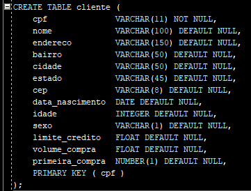
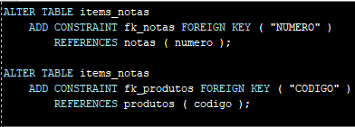
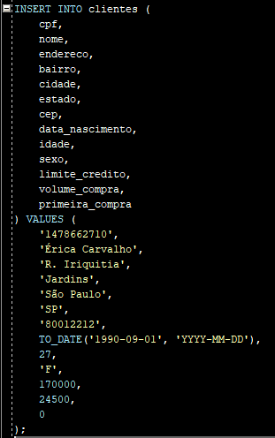
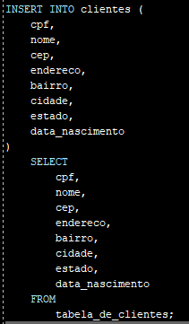

# Manipulação de dados no Oracle: Comandos DML
Repositório de exercícios propostos pelo **[Curso 3](https://cursos.alura.com.br/course/oracle-dml-manipulacao-de-dados)** da Formação "SQL com Oracle Database" da **[Alura](https://www.alura.com.br/)**.


Software utilizado: **[SQL Developer](https://www.oracle.com/tools/downloads/sqldev-downloads.html)**.

<br>

- Modelagem de um banco relacional
- Criando tabelas e relacionamentos entre elas
- Importando dados de arquivos externos para popular o banco
- Lidando com COMMIT e ROLLBACK
- Trabalhando com triggers e definindo sequências

<!-- 
<br>

## EXERCÍCIOS

**[01] Quantos clientes possuem o último sobrenome Mattos?**

<details>
<summary>Mostrar resposta</summary>
  


</details>

<hr>
<br>

**[02] Quantos bairros diferentes da cidade do Rio de Janeiro possuem clientes?**

<details>
<summary>Mostrar resposta</summary>
  


</details>

<hr>
<br>

**[03] Queremos obter as 10 primeiras vendas do dia 01/01/2017. Qual seria o comando SQL para obter este resultado?**

<details>
<summary>Mostrar resposta</summary>
  


</details>

<hr>
<br>

**[04] Utilizando duas querys SQL, qual foi a maior venda do produto "Linha Refrescante - 1 Litro - Morango/Limao", em quantidade?**

<details>
<summary>Mostrar resposta</summary>
  


</details>

<hr>
<br>

**[05] Aproveitando o exercício do vídeo anterior, quantos itens existem com a maior quantidade de venda para o produto '1101035'?**

<details>
<summary>Mostrar resposta</summary>
  


</details>

<hr>
<br>

**[06] Veja o ano de nascimento dos clientes e classifique-os como:**

- Nascidos antes de 1990 são velhos
- Nascidos entre 1990 e 1995 são jovens
- Nascidos depois de 1995 são crianças

**Liste o nome dos clientes e suas classificações.**

<details>
<summary>Mostrar resposta</summary>
  


</details>

<hr>
<br>

**[07] Como agrupar os produtos por embalagem, pegar a média de preço para cada tipo de embalagem e conferir o status de preço para cada embalagem (caro/em conta/barato)?**

<details>
<summary>Mostrar resposta</summary>
  


</details>

<hr>
<br>

**[08] Quais os clientes que fizeram mais de 2000 compras em 2016?**

<details>
<summary>Mostrar resposta</summary>
  


</details>

<hr>
<br>

**[09] Levando em consideração que o valor financeiro das vendas consiste em multiplicar a quantidade pelo preço, obtenha o faturamento anual da empresa.**

<details>
<summary>Mostrar resposta</summary>
  


</details>

<hr>
<br>

**[10] Tendo em vista a seguinte consulta:**
```sql
SELECT CPF, COUNT(*) FROM NOTAS_FISCAIS
WHERE TO_CHAR(DATA_VENDA, 'YYYY') = '2016'
GROUP BY CPF
HAVING COUNT(*) > 2000
```
**Qual seria a consulta, usando subconsulta, que seria equivalente à consulta acima?**

<details>
<summary>Mostrar resposta</summary>
  


</details>

<hr>
<br>

**[11] Faça uma consulta listando o nome do cliente e o endereço completo (com rua, bairro, cidade e estado).**

<details>
<summary>Mostrar resposta</summary>
  


</details>

<hr>
<br>

**[12] Faça uma sub-query que mostre o nome e a idade dos clientes.**

<details>
<summary>Mostrar resposta</summary>
  


</details>

<hr>
<br>

**[13] Na tabela de *notas fiscais*, temos o _valor do imposto_.**
**Na tabela de *itens*, temos a _quantidade_ e o _faturamento_. Calcule o valor do imposto pago no ano de 2016, arredondando para o menor inteiro.**

<details>
<summary>Mostrar resposta</summary>
  


</details>

<hr>
<br>

**[14] Com SQL, queremos que cada cliente tenha como saída:**

- *"O cliente **João da Silva** faturou **120000** no ano de **2016**".*

**OBS.: Faça isso somente para o ano de 2016.**

<details>
<summary>Mostrar resposta</summary>
  


</details>

<hr>
<br>

**[15]  Monte uma seleção que determina se as vendas mensais por cliente são válidas ou não. Considere como válidas as vendas abaixo da quantidade limite, e não válidas as vendas acima da quantidade limite existente no cadastro do cliente.**

<details>
<summary>Mostrar resposta</summary>
  


</details>

<hr>
<br>

**[16]  No exercício anterior, construímos um relatório que apresentou os clientes que tiveram vendas inválidas. Complemente este relatório, listando somente os que tiveram vendas inválidas e calculando a diferença entre o limite de venda máximo e o realizado, em percentuais. Dica:**

- Filtre somente as linhas onde:
```sql
(X.QUANTIDADE_LIMITE - X.QUANTIDADE_VENDAS) < 0
```

<br>

- Liste a coluna de X.QUANTIDADE_LIMITE
- Crie uma nova coluna, fazendo a fórmula:
```sql
(1 - (X.QUANTIDADE_LIMITE/X.QUANTIDADE_VENDAS)) * 100
```

<details>
<summary>Mostrar resposta</summary>
  


</details>

<hr>
<br>

**[17] Determine a venda por sabores de sucos, para o ano de 2016, apresentando o percentual de participação de cada um destes sabores, ordenados:**

<details>
<summary>Mostrar resposta</summary>
  


</details>

<hr>
<br>

**[18] Modifique o relatório de cima para ver o ranking das vendas por tamanho.**

<details>
<summary>Mostrar resposta</summary>
  


</details>

<hr>
<br>

 -->