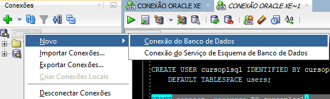
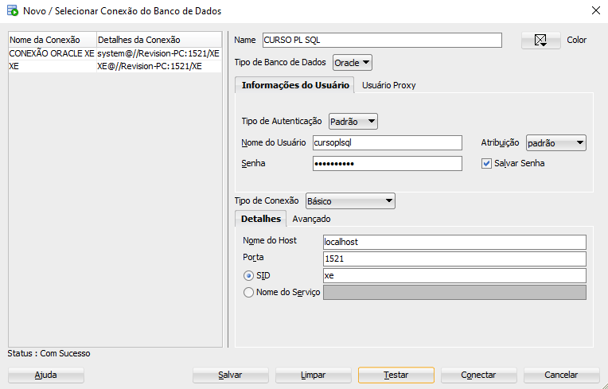

# Oracle PL/SQL: Procedures, funções e exceções
Repositório de exercícios propostos pelo **[Curso 4](https://cursos.alura.com.br/course/oracle-plsql-procedures-funcoes-excecoes)** da Formação "SQL com Oracle Database" da **[Alura](https://www.alura.com.br/)**.


Software utilizado: **[SQL Developer](https://www.oracle.com/tools/downloads/sqldev-downloads.html)**.

<br>

- Os principais comandos PL/SQL
- Inserir, atualizar e remover dados de tabelas
- Criar procedures e funções para encapsular código
- Recuperar registros com o Cursor
- Tratar e definir exceções

<br>

## Resumo

#### Criando um novo usuário e concedendo privilégios de acesso ao usuário no ambiente:

```sql
ALTER SESSION SET "_oracle_script" = true;

CREATE USER cursoplsql IDENTIFIED BY cursoplsql
    DEFAULT TABLESPACE users;

GRANT connect, resource TO cursoplsql;
```

<br>

#### Criando uma conexão e conectando o usuário nela

```sql
SHOW DATABASES;
```



<br>

#### Criando o esquema:

```sql
CREATE TABLE segmercado (
    id         NUMBER(5),
    descricao  VARCHAR2(100)
);

CREATE TABLE cliente (
    id                    NUMBER(5),
    razao_social          VARCHAR2(100),
    cnpj                  VARCHAR2(20),
    segmercado_id         NUMBER(5),
    data_inclusao         DATE,
    faturamento_previsto  NUMBER(10, 2),
    categoria             VARCHAR2(20)
);

ALTER TABLE segmercado ADD CONSTRAINT segmercado_id_pk PRIMARY KEY ( id );

ALTER TABLE cliente ADD CONSTRAINT cliente_id_pk PRIMARY KEY ( id );

ALTER TABLE cliente
  ADD CONSTRAINT cliente_segmercado_fk FOREIGN KEY ( segmercado_id )
    REFERENCES segmercado ( id );
```

<br>

#### Exemplo de um bloco PL/SQL:

```sql
SET SERVEROUTPUT ON;

DECLARE
    v_id NUMBER(5) := 1;
BEGIN
    v_ID := 2;
    dbms_output.put_line(v_id);
END;
```

<br>

#### Concedendo mais privilégios de acesso ao usuário "cursoplsql" / quota ilimitada para armazenar dados no tablespace:

```sql
ALTER USER cursoplsql
    QUOTA UNLIMITED ON users;
```
*Obs.: Utilizar o comando acima como script da conexão padrão (na conexão de instalação).*
<br>

#### Execução de comandos SQL em blocos PL/SQL:

SQL
```sql
INSERT INTO segmercado (
    id,
    descricao
) VALUES (
    1,
    'Varejo'
);
```

<br>

PL/SQL
```sql
DECLARE
    v_id         NUMBER(5) := 1;
    v_descricao  VARCHAR2(100) := 'Varejo';
BEGIN
    INSERT INTO segmercado (
        id,
        descricao
    ) VALUES (
        v_id,
        v_descricao
    );

    COMMIT;
END
```

<br>

#### Usando Percent Type (Se houver mudanças na estrutura do banco de dados, o programa não apresentará problemas)
```sql
DECLARE
    v_id         NUMBER(5) := 1;
    v_descricao  VARCHAR2(100) := 'Varejo';
BEGIN
    INSERT INTO segmercado (
        id,
        descricao
    ) VALUES (
        v_id,
        upper(v_descricao)
    );

    COMMIT;
END;
```

<br>

#### Usando vários comandos em bloco:
```sql
DECLARE
    v_ID         segmercado.id%TYPE := 2;
    v_DESCRICAO  segmercado.descricao%TYPE := 'Atacadista';
BEGIN
    UPDATE segmercado SET descricao = upper(v_DESCRICAO) WHERE id = v_ID;
    
    v_ID := 1;
    v_DESCRICAO := 'Varejista';
    UPDATE segmercado SET descricao = upper(v_DESCRICAO) WHERE id = v_ID;

    COMMIT;
END;
```

<br>

#### Removendo registros com PL/SQL:
```sql
DECLARE
    v_id segmercado.id%TYPE := 3;
BEGIN
    DELETE FROM segmercado WHERE id = v_id;

    COMMIT;
END;
```

<br>

#### Criando procedures
```sql
-- cria a procedure
CREATE PROCEDURE incluir_segmercado (
    p_id         IN  NUMBER,
    p_descricao  IN  VARCHAR2
) IS
BEGIN
    INSERT INTO segmercado (
        id,
        descricao
    ) VALUES (
        p_id,
        upper(p_descricao)
    );

    COMMIT;
END;

-- executa a procedura criada
EXECUTE incluir_segmercado(3, 'Farmaceuticos');

-- outra forma de executar a procedura criada
BEGIN
    incluir_segmercado(4, 'Industrial');
END;
```

<br>

#### Alterando procedures 
```sql
CREATE OR REPLACE PROCEDURE incluir_segmercado (
    p_id         IN  segmercado.id%TYPE,
    p_descricao  IN  segmercado.descricao%TYPE
) IS
BEGIN
    INSERT INTO segmercado (
        id,
        descricao
    ) VALUES (
        p_id,
        upper(p_descricao)
    );

    COMMIT;
END;
```

<br>

#### Retornando o descritor do segmento
```sql
SET SERVEROUTPUT ON;

DECLARE
    v_id         segmercado.id%TYPE := 1;
    v_descricao  segmercado.descricao%TYPE;
BEGIN
    SELECT
        descricao
    INTO v_descricao
    FROM
        segmercado
    WHERE
        id = v_id;

    dbms_output.put_line(v_descricao);
END;
```

<br>

#### Criando uma função
```sql
CREATE OR REPLACE FUNCTION obter_descricao_segmercado (
    p_id IN segmercado.id%TYPE
) RETURN segmercado.descricao%TYPE 
IS
    v_descricao segmercado.descricao%TYPE;
BEGIN
    SELECT
        descricao
    INTO v_descricao
    FROM
        segmercado
    WHERE
        id = p_id;

    RETURN v_descricao;
END;
```

<br>

#### Executando uma função
```sql
-- Utilizando SQL Puro
VARIABLE g_descricao VARCHAR2(100);

EXECUTE :g_descricao := obter_descricao_segmercado(1);

PRINT g_descricao;
/*
OUTPUT:
Procedimento PL/SQL concluído com sucesso.


G_DESCRICAO
--------------------------------------------------------------------------------
VAREJISTA
*/

-- Utilizando PL/SQL
SET SERVEROUTPUT ON;

DECLARE
    v_descricao segmercado.descricao%TYPE;
BEGIN
    v_descricao := obter_descricao_segmercado(2);
    dbms_output.put_line('A descrição do Segmento de Mercado é ' || v_descricao);
END;
/*
OUTPUT:
A descrição do Segmento de Mercado é ATACADISTA


Procedimento PL/SQL concluído com sucesso.
*/
```

<br>

<!-- 
#### 
```sql

```

<br>

#### 
```sql

```

<br>

#### 
```sql

```

<br>

## EXERCÍCIOS

**Realizar as operações no MySQL conforme as tabelas apresentadas abaixo.**


<hr>
<br>

### [Exercício 1]
**Recuperar o nome e o endereço de todos os funcionários que trabalham para o departamento "Pesquisa".**


<hr>
<br>

### [EXERCÍCIO 2] 
**Para cada projeto localizado em "Mauá", liste o número do projeto, o número do departamento que o controla, o último nome, endereço e data de nascimento do gerente do departamento.**


<hr>
<br>

### [EXERCÍCIO 3] 
**Descobrir os nomes dos funcionários que trabalham em todos os projetos controlados pelo departamento 5.**


<hr>
<br>

### [EXERCÍCIO 4] 
**Fazer uma lista dos números de projetos para aqueles que envolvem um funcionário cujo último nome é 'Souza'. Seja como trabalhador, seja como gerente do departamento que controla o projeto.**


<hr>
<br>

### [EXERCÍCIO 5] 
**Recuperar os nomes dos funcionários que não possuem dependentes.**


<hr>
<br>

### [EXERCÍCIO 6] 
**Listar o nome dos gerentes que possuem pelo menos um dependente.**


<hr>
<br>

 -->